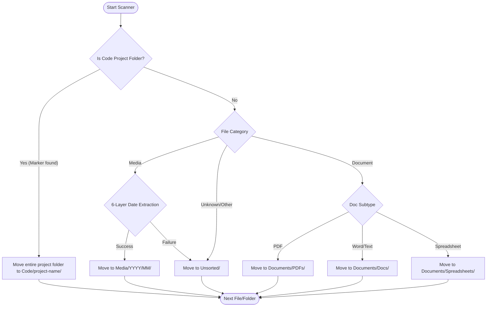

# 🗂 Drive Organizer

A smart, safety-first Python utility to scan, categorize, and organize messy hard drives into a clean, structured destination folder without breaking code projects or overwriting existing files.

---

## 🚀 Key Features

*   **🛡️ Project Protection**: Detects and preserves software projects (React, Node, Python, Rust, Java, etc.) by identifying project markers (`.git`, `package.json`, `Cargo.toml`, etc.) and moving the entire folder intact.
*   **📷 Accurate Media Sorting**: Uses a 6-layer fallback system (including EXIF metadata and filename parsing) to determine the exact creation date of photos and videos.
*   **🔒 Safety First**: 
    *   *Dry Run Mode*: Preview what will be moved where before any changes are made.
    *   *Non-destructive*: Files are copied or moved to a new destination; the source drive is left completely untouched.
    *   *No Overwrites*: Resolves name conflicts automatically by appending suffixes (e.g., `image_1.jpg`).
*   **📊 Clean Destination Schema**: Organizes files into dedicated folders for Media, Documents, Code, and Unsorted items.

---

## 📁 Destination Directory Structure

```text
destination_drive/
├── Media/
│   └── YYYY/
│       └── MM/
│           ├── photo.heic
│           └── video.mp4
├── Documents/
│   ├── PDFs/
│   ├── Docs/            # Word, Pages, TXT
│   └── Spreadsheets/    # Excel, CSV, Numbers
├── Code/
│   └── my-react-app/    # Moved as a complete folder
└── Unsorted/            # Files that couldn't be categorized
```

---

## ⚙️ How It Works (Workflow Diagram)



---

## 📅 Media Date Extraction (6 Fallback Layers)

To handle missing or corrupted file metadata, the organizer checks for dates in the following order:

| Priority | Source | Description | Example |
| :--- | :--- | :--- | :--- |
| **1** | `EXIF DateTimeOriginal` | Embedded camera sensor metadata (Actual capture time) | `2023:06:15 14:32:01` |
| **2** | `EXIF DateTimeDigitized`| Embedded date/time when file was digitized | `2023:06:15 14:35:00` |
| **3** | Filename Parsing | Regular expression patterns matching common photo/video naming structures | `IMG_20230615_120000.jpg` |
| **4** | macOS Birth Time | File creation timestamp on filesystem (`st_birthtime`) | File created June 15, 2023 |
| **5** | Modification Time | Last modified timestamp on filesystem (`st_mtime`) | File modified June 16, 2023 |
| **6** | Fallback | If all options above yield no valid date, the file is placed under `Unsorted/` | `Unsorted/image.jpg` |

---

## 🛠️ Get Started

1.  **Initialize Project Workspace**:
    Set this folder as your active workspace in your IDE.
2.  **Install Dependencies**:
    We will use standard library features where possible, plus `exifread` or `pillow` for EXIF metadata parsing.
3.  **Run Dry Run**:
    Execute the script with the `--dry-run` flag to preview organizing your drive safely.
