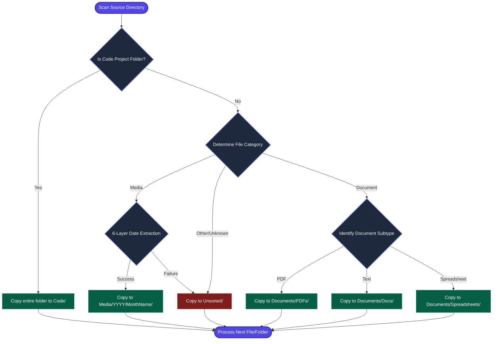

# Drive Organizer

Drive Organizer is a command-line utility written in Python to reorganize files from large storage drives (500GB+) into a structured destination directory. The tool focuses on safety, project detection, and deduplication to prevent data loss.

---

## Technical Features

| Feature | Functionality | Safety Mechanism |
| :--- | :--- | :--- |
| **Project Protection** | Detects development repositories (Git, Node.js, Python, etc.) | Moves the entire project folder intact to preserve compilation paths. |
| **Media Sorting** | Indexes photos and videos chronologically. | Utilizes a 6-layer date extraction fallback pipeline. |
| **Deduplication** | Identifies duplicate files. | Compares file checksums (MD5/SHA-256) to save storage space. |
| **Conflict Resolution** | Manages file name collisions. | Appends numerical suffixes to prevent file overwrites. |
| **Same-Volume Speed** | Bypasses physical file copying when reorganizing on the same disk. | Creates Hard Links or APFS Clones (instantaneous, consumes 0 bytes of extra storage). |
| **macOS Native Support** | Integrates macOS-specific APIs for a seamless user experience. | Utilizes APFS Cloning, Finder Color Tags for review, and system notification alerts. |
| **UX & Safety Checks** | Protects against common user errors and OS cache files. | Blocks circular path infinite loops, filters OS hidden files (.DS_Store), and runs pre-flight write checks. |
| **Resumable Batches** | Safely pauses and resumes transfers mid-way. | Commits a checkpoint registry (`.organizer_checkpoint.json`) every 50 files or 5GB to audit and skip verified copies on retry. |
| **Interactive Preview** | Runs a safe dry-run scan by default. | Displays execution maps and prompts for approval before disk writes. |

---

## Safety Guarantees

*   **Out-of-Place Organization**: The tool always writes the organized files into a **new destination folder**. It never modifies your source files in-place.
*   **Read-Only Source Policy**: The source directory is treated as read-only. No files on the source drive are altered, moved, or deleted, ensuring your original backup remains completely intact.
*   **System Sleep Prevention**: Automatically blocks macOS system sleep using `caffeinate` wrappers, ensuring your MacBook doesn't fall asleep and terminate the HDD transfer mid-way.
*   **Spotlight Indexing Suppression**: Automatically creates a `.metadata_never_index` file in your organized folder, preventing macOS Spotlight indexers from thrashing your HDD heads during copy operations.

---

## Directory Structures

### Codebase Layout
```text
hard-drive-organizer/
├── README.md               # Quick start guide (this file)
├── concept_design.md       # Technical design and architecture
├── requirements.txt        # Package dependencies
├── config.json             # File category mappings
├── organizer.py            # Main entry point
└── src/
    ├── __init__.py
    ├── scanner.py          # Filesystem walker
    ├── categorizer.py      # Rule engine
    ├── file_ops.py         # Disk operations
    └── utils.py            # Loggers and helpers
```

### Destination Drive Layout
```text
destination_drive/
├── Media/
│   └── YYYY/
│       └── MonthName/
│           ├── photo.heic
│           ├── video.mp4
│           └── raw_photo.dng
├── Documents/
│   ├── PDFs/
│   ├── Docs/            # txt, docx, pages
│   └── Spreadsheets/    # csv, xlsx, numbers
├── Code/
│   └── react-app/       # Copied as an intact directory
└── Unsorted/            # Uncategorized or metadata-less files
```

---

## System Workflows

### Execution Flowchart


---

## Date Extraction Reference

The tool checks the following metadata sources in order of priority to determine a media file's chronological location:

| Priority | Source | Description | Example |
| :---: | :--- | :--- | :--- |
| **1** | EXIF DateTimeOriginal | Embedded camera sensor acquisition time. | `2023:06:15 14:32:01` |
| **2** | EXIF DateTimeDigitized | Embedded digitization timestamp. | `2023:06:15 14:35:00` |
| **3** | Filename Parsing | Regex patterns matching date sub-strings. | `IMG_20230615_120000.jpg` |
| **4** | macOS Birth Time | File creation timestamp on filesystem. | June 15, 2023 |
| **5** | Modification Time | Last modified timestamp on filesystem. | June 16, 2023 |
| **6** | Fallback Directory | Placed in `Unsorted/` folder. | `Unsorted/image.jpg` |

---

## Quick Start

### 1. Configure the Environment
Ensure your terminal path points to this workspace, and install the library dependencies:
```bash
pip3 install -r requirements.txt
```

### 2. Run Preview
Perform a preview dry-run scan to verify size mappings, duplicate counts, and file placement maps without altering any files:
```bash
python3 organizer.py /path/to/source /path/to/destination --preview
```

### 3. Run Organization
To write the organized file structure to the destination directory, run:
```bash
python3 organizer.py /path/to/source /path/to/destination --copy
```
