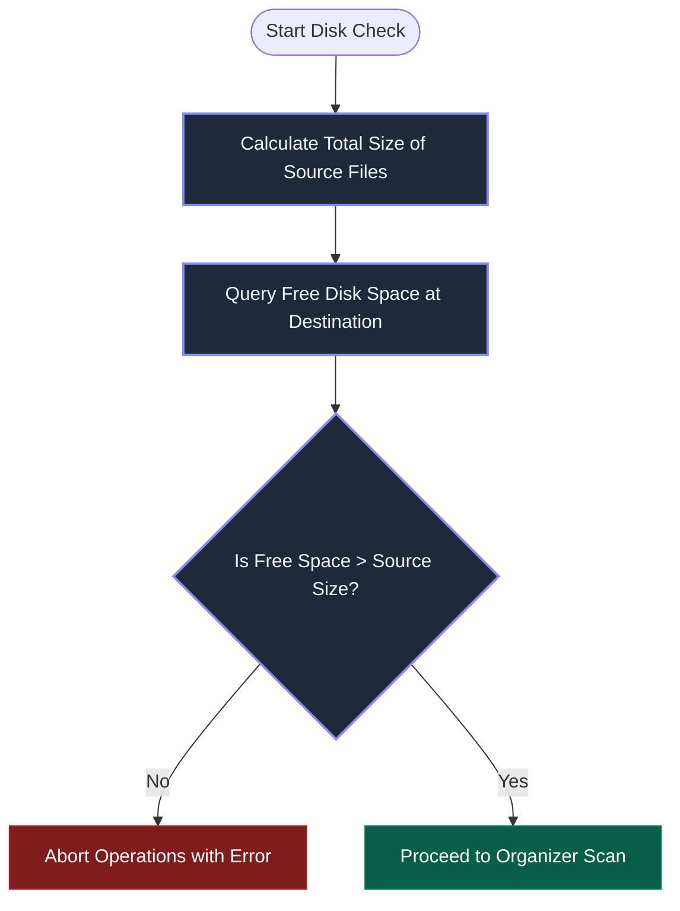
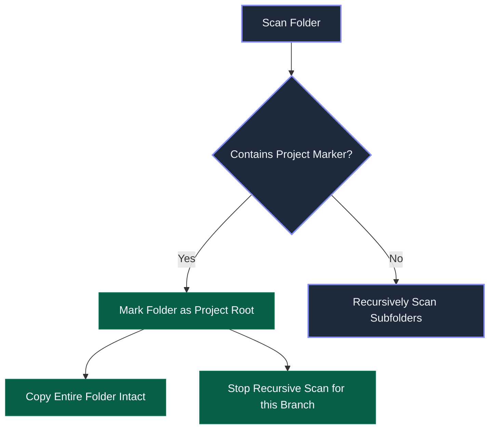
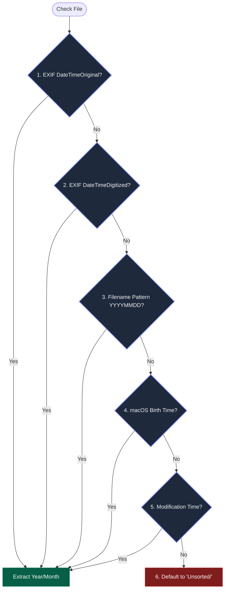
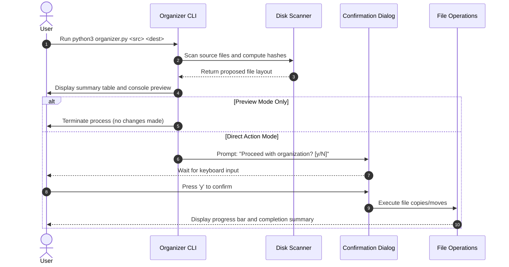
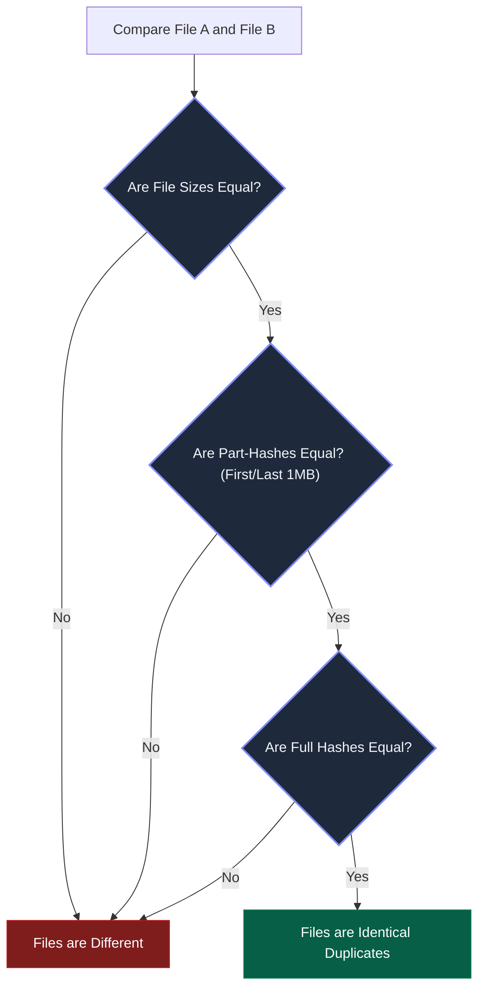
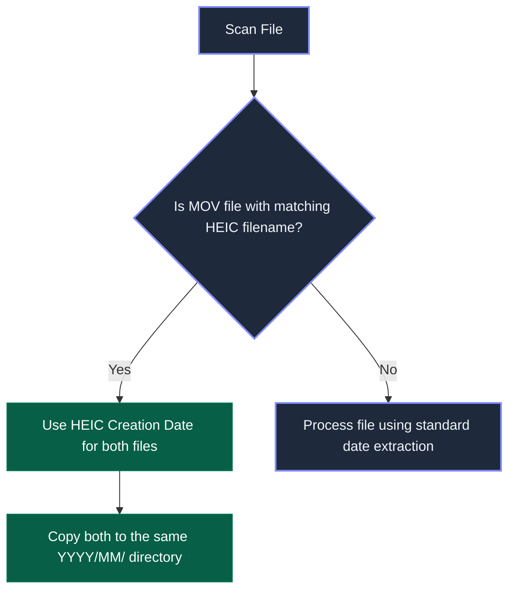
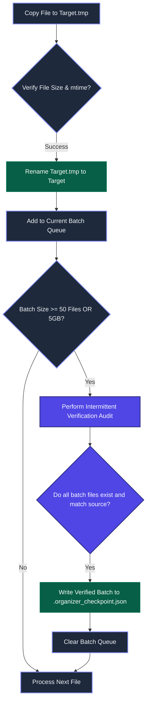

# Drive Organizer: Concept and Architecture Design

This document details the functional design, safety mechanisms, and directory structures for the Drive Organizer tool. This utility is designed to organize large volumes of data (500GB+) by scanning a source directory, identifying file types and code projects, and copying them into a structured destination folder.

---

## 1. Safety and Data Integrity

When processing large volumes of personal data, safety is the primary requirement.

### A. Operations and Out-of-Place Execution
*   **Out-of-Place Copying (Default)**: The script requires a separate `<source_path>` and `<destination_path>`. It reads files from the source and copies them into a fresh directory structure at the destination. The original files are left 100% untouched.
*   **Read-Only Source Enforcement**: The source folder is treated as strictly read-only. The tool performs no write, rename, or delete operations on the source files.
*   **Optional Move Mode**: A `--move` flag is available but disabled by default. If enabled, files are copied, verified with checksums, and only deleted from the source after successful verification.

### B. Disk Space Verification
Before starting any copy or move operations, the tool performs a pre-flight capacity check:



### C. Name Conflict Resolution
When two different files share the exact same filename, the system resolves the conflict using checksum verification:

| File Comparison Status | Verification Method | Action Taken |
| :--- | :--- | :--- |
| **Identical Content** | Content hashes (MD5/SHA-256) match | Skip copying the duplicate file; log action in a registry file. |
| **Different Content** | Content hashes (MD5/SHA-256) differ | Rename the destination file with a numerical suffix (e.g., `file_1.jpg`). |

---

## 2. File Categorization Strategy

To organize a wide variety of documents, archives, creative assets, and code files, the system categorizes files using rule-based extension mappings defined in `config.json`.

### A. File Categorization Matrix
Files are grouped into target folders based on their file extensions:

| Category | Sub-category | Target Directory | Common Extensions |
| :--- | :--- | :--- | :--- |
| **Media (Photos)** | Standard Images | `Media/YYYY/Month/` | `.jpg`, `.jpeg`, `.png`, `.heic`, `.webp` |
| | RAW Images | `Media/YYYY/Month/` | `.cr2`, `.nef`, `.arw`, `.dng` |
| **Media (Videos)** | Standard Videos | `Media/YYYY/Month/` | `.mp4`, `.mov`, `.avi`, `.mkv` |
| **Documents** | Text Documents | `Documents/Text/` | `.txt`, `.rtf`, `.md` |
| | Word Documents | `Documents/Word/` | `.doc`, `.docx`, `.pages` |
| | Spreadsheets | `Documents/Spreadsheets/` | `.csv`, `.xls`, `.xlsx`, `.numbers` |
| | Presentations | `Documents/Presentations/` | `.ppt`, `.pptx`, `.key` |
| | PDF Documents | `Documents/PDF/` | `.pdf` |
| **Design & Creative** | Graphic Projects | `Creative/Projects/` | `.psd`, `.ai`, `.xd`, `.fig`, `.sketch` |
| | Audio Files | `Creative/Audio/` | `.mp3`, `.wav`, `.aac`, `.flac` |
| **Archives** | Compressed Files | `Archives/` | `.zip`, `.tar`, `.gz`, `.tgz`, `.rar`, `.7z` |
| **E-Books** | Reading Material | `E-Books/` | `.epub`, `.mobi` |
| **Code (Snippets)** | Single Code Files | `Code/Snippets/` | `.py`, `.js`, `.html`, `.css`, `.cpp`, `.sh` |

### B. Custom Configuration Mappings
The system configuration is read from `config.json`, allowing the user to map categories to extensions and define project markers:

```json
{
  "categories": {
    "Media/Photos": [".jpg", ".jpeg", ".png", ".heic", ".webp"],
    "Media/RAW": [".cr2", ".nef", ".arw", ".dng"],
    "Media/Videos": [".mp4", ".mov", ".avi", ".mkv"],
    "Documents/PDF": [".pdf"],
    "Documents/Word": [".doc", ".docx", ".pages"],
    "Documents/Spreadsheets": [".xls", ".xlsx", ".csv", ".numbers"],
    "Documents/Presentations": [".ppt", ".pptx", ".key"],
    "Documents/Text": [".txt", ".rtf", ".md"],
    "Creative/Projects": [".psd", ".ai", ".xd", ".fig", ".sketch"],
    "Creative/Audio": [".mp3", ".wav", ".aac", ".flac"],
    "Archives": [".zip", ".tar", ".gz", ".tgz", ".rar", ".7z"],
    "E-Books": [".epub", ".mobi"],
    "Code/Snippets": [".py", ".js", ".html", ".css", ".cpp", ".sh"]
  },
  "project_markers": [
    ".git",
    "package.json",
    "requirements.txt",
    "Cargo.toml",
    "go.mod",
    "pom.xml",
    "build.gradle"
  ]
}
```

---

## 3. Code Project Identification

Software projects (e.g., React apps, Python libraries) must be moved as single, unbroken directories rather than being split into individual files.

### A. Project Markers
The scanner checks folders recursively for the presence of the following files or folders:

| Language/Framework | Directory Marker | File Marker |
| :--- | :--- | :--- |
| Git | `.git/` | |
| JavaScript / TypeScript | `node_modules/` | `package.json`, `deno.json` |
| Python | `venv/`, `.venv/` | `requirements.txt`, `pyproject.toml`, `setup.py` |
| Rust | | `Cargo.toml` |
| Go | | `go.mod` |
| Java / Kotlin | | `pom.xml`, `build.gradle` |

### B. Nested Project Prevention
To prevent subfolders within a mono-repo or nested directory structure from being processed independently, the scanner halts recursive directory traversal inside a project folder:



---

## 4. Date Detection Pipeline

For media files, the tool extracts the media creation date to organize files chronologically. The system applies a 6-layer priority model:



---

## 5. Command Line Interface and Previews

The tool operates strictly in preview mode by default to ensure transparency before editing disk contents.

### A. Execution Sequence


### B. Command Flags
| Flag | Alternative | Description | Default |
| :--- | :--- | :--- | :--- |
| `-p` | `--preview` | Scan files and log operations without writing changes. | True |
| `-y` | `--yes` | Skip user confirmation prompts. | False |
| `--copy` | | Copy files from source to destination. | True |
| `--move` | | Move files from source to destination (copies, verifies, deletes). | False |
| `--min-size` | | Ignore files smaller than the threshold (e.g. `10KB`). | None |
| `--config` | | Path to custom configuration JSON file. | None |

---

## 6. Performance Optimizations for Large Datasets (500GB+)

Processing up to 1TB of data requires optimization of read/write speeds based on hardware constraints.

### A. Fast Duplicate Check (Part-Hashing)
Calculating the SHA-256 hash of large 4K video files (often 2GB to 10GB each) slows down operations significantly. We use a multi-tiered validation approach:



### B. Same-Volume Acceleration (Instant Transfers)
If the source folder and destination folder reside on the **same drive volume**, we can bypass physical file copies:

*   **Hard Links (`os.link`)**: We create a hard link in the destination folder pointing to the original file's disk sectors. This is **instantaneous** (takes milliseconds), utilizes **zero bytes of extra space**, and leaves original files intact. Deleting the source link later does not affect the destination file.
*   **APFS Clones (macOS Copy-on-Write)**: On macOS APFS volumes, the script uses APFS clone calls to instantly copy metadata blocks while sharing data sectors.
*   **Fallback**: If source and destination are on different volumes, the tool falls back to full physical copies.

### C. Drive-Type Aware Concurrency
Mechanical Hard Disk Drives (HDDs) suffer major performance drops when subjected to concurrent random reads/writes (disk head thrashing). The tool optimizes execution based on drive type:

| Destination Drive Type | Concurrency Mode | Rationale |
| :--- | :--- | :--- |
| **Mechanical HDD** | Single-Threaded Sequential | Maximizes sequential read/write throughput; prevents head thrashing. |
| **Solid-State Drive (SSD)** | Multi-Threaded Parallel | Utilizes concurrent bus lanes and high random I/O speeds (up to 4 parallel workers). |

### D. Lightweight Verification
Instead of computing full verification hashes after copying large media files (which reads the file twice), the script verifies successful transfers by matching:
1. File size.
2. File modification time (mtime).
Full checksum calculation is only triggered if file sizes match during duplicate detection.

---

## 7. Device-Specific Handling (DJI, iOS, Android)

Media metadata formats and filenames vary significantly by device. The tool handles these differences as follows:

| Device Type | Common Filenames | Video Format | Key Metadata Source | Special Handling |
| :--- | :--- | :--- | :--- | :--- |
| **DJI Osmo Pocket** | `DJI_0001.MP4`, `DJI_0002.MOV` | H.264 / HEVC | QuickTime UserData (`moov/mvhd` atom) | DJI video files do not contain EXIF data. The parser reads container metadata directly. |
| **Apple iPhone** | `IMG_4821.HEIC`, `IMG_4821.MOV` | HEIC / H.265 | Apple EXIF & QuickTime metadata | **Live Photo Pairing**: HEIC images and matching MOV clips are linked and grouped in the same month folder. |
| **Android Devices** | `PXL_20230615_120000.jpg`, `IMG_20230615_120000.jpg` | JPG / MP4 | Standard EXIF & Filename regex | Android filenames embed dates natively. Fallback to regex parsing if EXIF is missing. |

### Live Photo Pairing Flow
To prevent Live Photo components (HEIC and MOV) from being separated, they are kept together:



---

## 8. Advanced Reliability and Creator Features

To handle massive datasets (500GB+) reliably, the system incorporates the following stability features:

### A. Checkpoint-Based Resumability and Interval Verification
To prevent data corruption and allow instant resumption of interrupted 1TB transfers, the copy engine operates in validated intervals backed by a checkpoint registry file (`.organizer_checkpoint.json` written to the destination root folder):

#### 1. Checkpoint Registry Structure
At regular intervals, the current execution state is saved to the disk. The `.organizer_checkpoint.json` stores:
```json
{
  "session_id": "session_2026_06_03_1854",
  "source_root": "/Volumes/SourceHDD",
  "dest_root": "/Volumes/DestHDD",
  "status": "in_progress",
  "last_updated": 1780512850.0,
  "verified_files": {
    "relative/path/to/photo.heic": {
      "dest_path": "Media/2026/June/photo.heic",
      "size": 4120300,
      "mtime": 1780510000.0,
      "status": "verified"
    }
  }
}
```

#### 2. Interval Verification Engine (Every 50 Files or 5GB)
To verify write integrity, the copy coordinator runs validation checks in batches:



#### 3. Resume and Recontinue Flow
If a session terminates unexpectedly (e.g. disk disconnection), restarting the script triggers the recovery flow:
1.  **Scan Checkpoint**: The tool checks for `.organizer_checkpoint.json` in the destination folder.
2.  **Verify Incomplete Status**: If the session status is `"in_progress"`, it prompts the user:
    `An interrupted session was found. Resume transferring remaining files? [Y/n]`
3.  **Filter Scan List**: If accepted, the scanner loads all `"verified"` paths from the JSON and excludes them from the source scanner walk, continuing instantly from the first incomplete file.
4.  **Finalize**: Upon successful completion of the entire copy operation, the `.organizer_checkpoint.json` file status is updated to `"completed"` (or safely deleted, leaving a clean directory).

### B. Camera Sidecar File Association
Professional cameras generate auxiliary files (e.g., subtitles, metadata, thumbnails) alongside raw footages. The tool detects and binds these assets:

| Main File Type | Sidecar Extensions | Behavior |
| :--- | :--- | :--- |
| Video (`.MP4`, `.MOV`) | `.SRT` (Subtitles), `.THM` (Thumbnail), `.XML` (Profiles) | The sidecar file inherits the date of the primary video file and is saved in the same directory. |
| RAW Photo (`.CR2`, `.ARW`) | `.WAV` (Audio notes), `.XMP` (Metadata changes) | The sidecar is copied adjacent to the RAW file, keeping creative modifications intact. |

### C. Execution Reporting
At the end of a run, the system exports a `run_summary.json` to the destination directory root:
*   **Total Size & Count**: Total volume and count of processed files.
*   **Duplicates Log**: List of identical files that were skipped (with source paths).
*   **Unsorted Registry**: Paths of files moved to `Unsorted/` due to missing metadata.

---

## 9. macOS Native Optimizations and Integrations

Since the host environment is macOS, the system integrates native OS capabilities to optimize file handling and user feedback.

### A. APFS Copy-on-Write Cloning
On APFS drives (default on macOS), copying files on the same volume can be done instantly without writing duplicate data blocks:
*   **Implementation**: The copy engine utilizes Python's `shutil.copy2` (which uses macOS system level `clonefile` system calls under the hood) or explicitly calls the `cp -c` shell execution if needed.
*   **Result**: 100% data separation with instantaneous copy speeds and zero storage consumption.

### B. Finder Tag Integration
To help you review organized files directly in Finder, the script writes macOS extended attributes (`xattr`) to apply native color tags:

| Target File Group | Tag Color | Tag Name | User Action |
| :--- | :--- | :--- | :--- |
| **Unsorted/ Folder** | Yellow | `To Review` | Manually review items with missing dates or categories. |
| **Duplicates (Logged)** | Gray | `Duplicate` | Audited skipped files that matched active records. |
| **Successfully Organized** | Green | `Organized` | Standard completion flag. |

*Note: Tags are written using native Python `xattr` bindings targeting `com.apple.metadata:_kMDItemUserTags`.*

### C. macOS User Notification Alerts
For long scans on large 1TB+ drives, the tool sends a native desktop notification upon scan completion or error alerts:

```bash
osascript -e 'display notification "File organization complete!" with title "Drive Organizer" sound name "Glass"'
```

### D. Spotlight Indexing Suppression
During a large transfer, macOS Spotlight (`mds`/`mdworker`) and QuickLook automatically index newly written files, causing major HDD CPU thrashing and slowing write speeds:
*   **Solution**: Before copying, the tool automatically creates an empty `.metadata_never_index` file in the destination root directory.
*   **Result**: Tells macOS to bypass index scanning on the directory, maximizing write speeds to the external HDD.

### E. Laptop Sleep Prevention (Caffeinate)
To prevent your MacBook from going to sleep or entering standby mode during a 1TB transfer (which would abort the copy and potentially leave files corrupted):
*   **Solution**: The script runs under a macOS `caffeinate` execution wrapper (using Python's `subprocess` or native OS assertions to block system sleep).
*   **Result**: The MacBook screen can turn off, but the CPU, system bus, and USB connections remain active until the copy operation finishes.

### F. USB Connection Speed Diagnostics
External HDDs connected via USB-C dongles or cheap hubs can fallback to slow USB 2.0 speeds (limited to ~40MB/s), making a 1TB transfer take over 8 hours:
*   **Solution**: The script runs a pre-check command:
    ```bash
    system_profiler SPUSBDataType
    ```
    If it detects the target drive is negotiated on a USB 2.0 bus instead of a USB 3.0/3.1 SuperSpeed bus, it displays a warning:
    `Warning: Your external HDD is connected via a USB 2.0 interface. This transfer may take 3x longer. Please connect directly to a laptop Type-C port.`

---

## 10. Logical and User Experience Preventions

To prevent user mistakes and ensure a highly polished user experience, the tool implements several validation checks:

### A. Circular Path Verification (Infinite Loops)
If a user mistakenly sets the destination directory *inside* the source directory (e.g., source: `/Volumes/MyHDD/` and destination: `/Volumes/MyHDD/Sorted/`), standard recursive scanners will scan files, copy them into the destination, scan the copies, and copy them again in an infinite loop until the disk runs out of space.
*   **Prevention**: The tool performs a pre-flight path comparison. If the destination directory is a subdirectory of the source directory, it automatically excludes the destination path from the scan list and warns the user.

### B. Hidden System File Filtering
Operating systems and devices generate cache and metadata files that should not clutter the organized structure:
*   **Action**: The scanner automatically ignores hidden files and directories:
    *   **macOS system files**: `.DS_Store`, `.localized`, `.Trash/`, `.Spotlight-V100/`, `.fseventsd/`
    *   **Android cache/thumbnails**: `.thumbnails/`, `._*` (AppleDouble files), `Thumbs.db`

### C. Write Permissions Verification (Pre-Flight Test)
To prevent starting a multi-hour copy operation only for it to fail due to insufficient folder write permissions:
*   **Action**: Before scanning, the tool attempts to write, read, and delete a small, random dummy file in the target destination directory.
*   **Result**: If permissions are missing, it terminates immediately with a clear error prompt, saving hours of unnecessary execution time.

### D. Interactive Progress Visualizer
During a long 1TB transfer, standard command outputs can feel static or unresponsive. The utility uses a detailed progress bar (via the `tqdm` or `rich` library) displaying:
*   **Visual Indicators**: Real-time progress percentage and bar.
*   **Speed Metrics**: Current MB/s transfer rate and estimated remaining time (ETA).
*   **Active Log**: Name and path of the current file being processed.

---

## 11. Proposed Codebase Structure

```text
hard-drive-organizer/
├── README.md               # Quick start and configuration
├── concept_design.md       # Architectural specifications (this file)
├── requirements.txt        # Third-party metadata packages
├── config.json             # File category rules
├── organizer.py            # Main application entry point
└── src/
    ├── __init__.py
    ├── scanner.py          # Filesystem indexer
    ├── categorizer.py      # Category and date analyzer
    ├── file_ops.py         # File copy, rename, and verification
    └── utils.py            # Logging and formatting tools
```

---

## 12. Architecture Decisions

| Decision Topic | Proposed Alternative A | Proposed Alternative B | Chosen Architecture |
| :--- | :--- | :--- | :--- |
| **File Duplicates** | Copy duplicates to a `Duplicates/` directory | Skip identical files and log them in a registry | **Alternative B** (Saves disk space on 500GB+ drives) |
| **Rule Configurations** | Define category lists in `config.json` | Hardcode file extensions in python files | **Alternative A** (Enables custom configuration without code modifications) |

