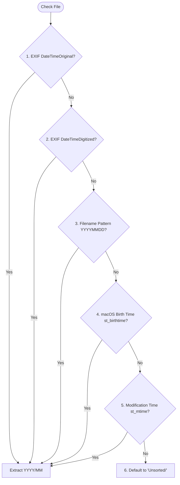

# 🧠 Drive Organizer: Bulletproof Concept & Design

Before writing code, let's explore all potential edge cases, safety measures, and architectural decisions to ensure this tool is robust, fast, and 100% safe to run on 500GB+ of personal data.

---

## 1. Safety & Data Integrity (Crucial)

When dealing with large volumes of personal data, safety is the absolute #1 priority.

### A. Copy vs. Move
*   **Default Behavior**: **Copy** files to the destination. Never delete or alter the source files unless the user explicitly passes a `--delete-source` flag *and* has run a successful validation check.
*   **Recommendation**: Keep Copy as the default behavior. It preserves the original drive structure as a perfect backup.

### B. Duplicate Name Conflicts
*   *Scenario*: You have two files named `IMG_0123.jpg` (e.g., from two different cameras or resets).
*   *Solution*:
    1.  Compute a quick content checksum (SHA-256 or MD5) for both files.
    2.  If the checksums match, the files are **identical duplicates**. We can skip copying the duplicate to save space, but log it in a duplicate registry.
    3.  If the checksums do *not* match, they are **different files with the same name**. We rename the new file by appending a counter: `IMG_0123_1.jpg`, `IMG_0123_2.jpg`.

### C. Write Failure / Disk Full
*   *Scenario*: The destination drive runs out of space during a 300GB transfer.
*   *Solution*:
    1.  The script must check available disk space on the destination drive *before* starting the copy.
    2.  Check space before copying each individual file/folder. If space is insufficient, halt gracefully and print a summary of what succeeded and what failed.

---

## 2. Advanced Code Project Detection

Code projects are fragile. Breaking them into individual files (like moving a `.js` file to `Documents/`) would ruin them.

### A. Identification Markers
We will scan folders recursively. If a folder contains any of the following files/directories, it is classified as a **Code Project** and moved as a single, unbroken unit:
*   **Git**: `.git/`
*   **JavaScript/TypeScript**: `package.json`, `node_modules/`, `deno.json`
*   **Python**: `requirements.txt`, `pyproject.toml`, `Pipfile`, `setup.py`, `venv/`, `.venv/`
*   **Rust**: `Cargo.toml`
*   **Go**: `go.mod`
*   **Java/Kotlin**: `pom.xml`, `build.gradle`
*   **C/C++**: `Makefile`, `CMakeLists.txt`
*   **Docker**: `Dockerfile`, `docker-compose.yml`

### B. Nesting Protection (Mono-repos)
*   *Scenario*: A project folder has sub-folders that also contain project markers.
*   *Solution*: The script should work **top-down**. As soon as it encounters a directory containing a project marker, it marks that directory as the project root, copies it in its entirety, and **stops scanning deeper inside that branch**.

---

## 3. Date Detection Strategy (6 Layers)

We want to get the correct year and month for media files, avoiding placing them in `Unsorted` whenever possible.



### Pattern Matching for Filenames (Layer 3)
Many cameras and messaging apps format filenames containing dates:
*   `IMG_20230615_123456.jpg` -> `2023/06`
*   `VID-20220910-WA0001.mp4` -> `2022/09`
*   `2021-04-12_Photos.heic` -> `2021/04`

We will implement a regex-based parser that scans the filename for date-like substrings (`YYYY-MM-DD` or `YYYYMMDD`).

---

## 4. User Experience & Command Line Interface

To make the script easy and safe to use, we will provide a rich command-line experience.

### CLI Command Options
```bash
python3 organizer.py <source_path> <destination_path> [flags]
```

*   `--dry-run`: Scans and logs what *would* happen, without writing or moving any files.
*   `--copy` (Default): Copies files to the destination.
*   `--move`: Moves files (copies and then deletes from source after verifying hash).
*   `--min-size`: Ignore files smaller than a certain size (e.g. `--min-size 10KB` to filter out junk/thumbnails).
*   `--config`: Path to a custom config file (JSON) to customize categories, extensions, or project markers.

---

## 5. Proposed Folder Structure for Codebase

We will keep the code clean and modular:

```text
hard-drive-organizer/
├── README.md               # Quick overview
├── concept_design.md       # Detailed architectural design (this file)
├── requirements.txt        # Third-party dependencies (e.g., exifread, pillow)
├── config.json             # File category mappings & project markers config
├── organizer.py            # Main CLI entry point
└── src/
    ├── __init__.py
    ├── scanner.py          # Walks the filesystem & detects projects
    ├── categorizer.py      # Identifies file type & extracts dates
    ├── file_ops.py         # Safely copies, renames, and verifies hashes
    └── utils.py            # Helper functions (logging, formatting)
```

---

## 🤔 Open Discussion Questions

Before we write the code, what are your thoughts on:
1.  **Duplicate Files**: Do you want duplicates grouped together in a special `Duplicates/` folder, or is it okay to simply skip them if they match existing files in the destination?
2.  **Config file**: Should we use a `config.json` file to define what files go where (e.g., `.pdf` goes to `Documents/PDFs`), or do you prefer to keep these rules hardcoded in the Python script to make it simpler to run as a single file?
